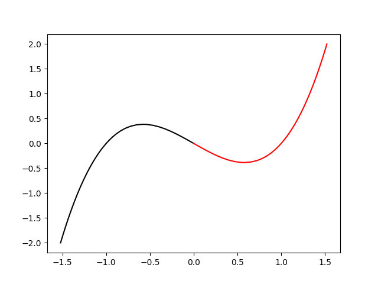
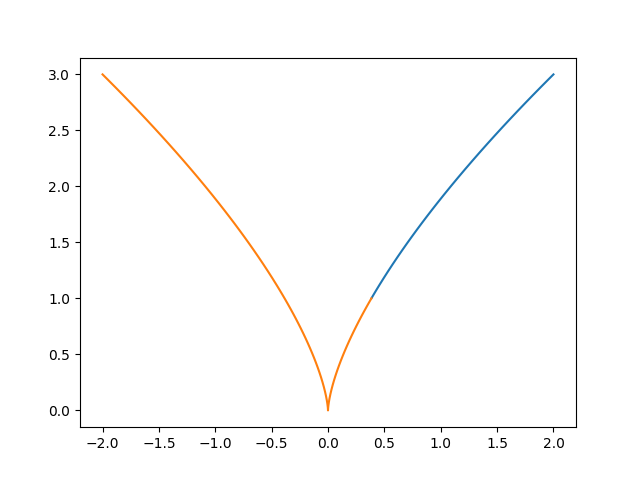

* Cusp bifurcation

\begin{equation}
\dot{x} = \mu + \lambda x - x^{3}
\end{equation}

#+BEGIN_SRC python :session py_ses1
  from auto import *
  import numpy as np
  import matplotlib.pyplot as plt
#+END_SRC

#+RESULTS:
: None

#+BEGIN_SRC bash :session sh1 :eval never
  ls | grep cusp
#+END_SRC

| c.cusp     | cusp.auto  | cusp.exe   | cusp.f90   | cusp.ipynb | cusp.o     |

#+BEGIN_SRC python :session py_ses1 
  cusp = load('cusp')
  mu = run(cusp)
  mu = mu + run(cusp, DS='-')

  mu = rl(mu)
  save(mu, 'mu')
  lp1 = load(mu('LP1'), ISW=2)
  

#+END_SRC

#+RESULTS:
: None

#+BEGIN_SRC python :session py_ses1
    plt.plot(mu[0]['x'],mu[0]['mu'], 'k')
    plt.plot(mu[1]['x'],mu[1]['mu'], 'r')
    plt.savefig("./images/cubic_xVsmu.png", format="png")
    plt.show()
    plt.close()
#+END_SRC

#+RESULTS:
: None

#+CAPTION: The cubic shaped x-nullcline as a function of the parameter $\mu$
#+NAME: fig:first

#+BEGIN_SRC python :session py_ses1 
mu.summary()
#+END_SRC

#+begin_example

  BR    PT  TY  LAB       mu         L2-NORM          x           lambda    
   1     1  EP    1   0.00000E+00   0.00000E+00   0.00000E+00   1.00000E+00
   1    14  LP    2   3.84900E-01   5.77360E-01  -5.77360E-01   1.00000E+00
   1    20        3   1.26582E-01   9.29410E-01  -9.29410E-01   1.00000E+00
   1    40        4  -1.38347E+00   1.40803E+00  -1.40803E+00   1.00000E+00
   1    47  UZ    5  -1.99999E+00   1.52138E+00  -1.52138E+00   1.00000E+00

  BR    PT  TY  LAB       mu         L2-NORM          x           lambda    
   1     1  EP    6   0.00000E+00   0.00000E+00   0.00000E+00   1.00000E+00
   1    14  LP    7  -3.84900E-01   5.77360E-01   5.77360E-01   1.00000E+00
   1    20        8  -1.26582E-01   9.29410E-01   9.29410E-01   1.00000E+00
   1    40        9   1.38347E+00   1.40803E+00   1.40803E+00   1.00000E+00
   1    47  UZ   10   1.99999E+00   1.52138E+00   1.52138E+00   1.00000E+00
#+end_example

#+begin_example

  BR    PT  TY  LAB       mu         L2-NORM          x           lambda    
   1     1  EP    1   0.00000E+00   0.00000E+00   0.00000E+00   1.00000E+00
   1    14  LP    2   3.84900E-01   5.77360E-01  -5.77360E-01   1.00000E+00
   1    20        3   1.26582E-01   9.29410E-01  -9.29410E-01   1.00000E+00
   1    40        4  -1.38347E+00   1.40803E+00  -1.40803E+00   1.00000E+00
   1    47  UZ    5  -1.99999E+00   1.52138E+00  -1.52138E+00   1.00000E+00

  BR    PT  TY  LAB       mu         L2-NORM          x           lambda    
   1     1  EP    6   0.00000E+00   0.00000E+00   0.00000E+00   1.00000E+00
   1    14  LP    7  -3.84900E-01   5.77360E-01   5.77360E-01   1.00000E+00
   1    20        8  -1.26582E-01   9.29410E-01   9.29410E-01   1.00000E+00
   1    40        9   1.38347E+00   1.40803E+00   1.40803E+00   1.00000E+00
   1    47  UZ   10   1.99999E+00   1.52138E+00   1.52138E+00   1.00000E+00
#+end_example

#+BEGIN_SRC python :session py_ses1
lp1
#+END_SRC

#+begin_example
  BR    PT  TY  LAB ISW NTST NCOL NDIM IPS IPRIV
   1    14  LP    2   1    1    0    1   1     0
Pointset cusp (parameterized)
Independent variable:
t:  [0.]
Coordinates:
x:  [-0.57735966]
Labels by index: Empty
Active ICP: [2]
rldot: [np.float64(0.0018853769549)]
udotps: Pointset cusp (non-parameterized)
Coordinates:
UDOT(1):  [-0.99999822]
Labels by index: Empty
PAR(1:5):       lambda             mu                 PAR(3)             PAR(4)             PAR(5)         
              1.0000000000E+000  3.8490017931E-001  0.0000000000E+000  0.0000000000E+000  0.0000000000E+000
PAR(6:10):    0.0000000000E+000  0.0000000000E+000  0.0000000000E+000  0.0000000000E+000  0.0000000000E+000
PAR(11:11):   0.0000000000E+000
#+end_example

#+begin_example
  BR    PT  TY  LAB ISW NTST NCOL NDIM IPS IPRIV
   1    14  LP    2   1    1    0    1   1     0
Pointset cusp (parameterized)
Independent variable:
t:  [0.]
Coordinates:
x:  [-0.57735966]
Labels by index: Empty
Active ICP: [2]
rldot: [np.float64(0.0018853769549)]
udotps: Pointset cusp (non-parameterized)
Coordinates:
UDOT(1):  [-0.99999822]
Labels by index: Empty
PAR(1:5):       lambda             mu                 PAR(3)             PAR(4)             PAR(5)         
              1.0000000000E+000  3.8490017931E-001  0.0000000000E+000  0.0000000000E+000  0.0000000000E+000
PAR(6:10):    0.0000000000E+000  0.0000000000E+000  0.0000000000E+000  0.0000000000E+000  0.0000000000E+000
PAR(11:11):   0.0000000000E+000
#+end_example

#+BEGIN_SRC python :session py_ses1
  cusp = run(lp1)
  cusp = cusp + run(lp1, DS='-')
  save(cusp, 'cusp')
#+END_SRC

#+RESULTS:
: None

#+BEGIN_SRC python :session py_ses1
cusp.summary()
#+END_SRC

#+begin_example

  BR    PT  TY  LAB       mu         L2-NORM          x           lambda    
   2    20       11   1.09209E+00   8.17354E-01  -8.17354E-01   2.00420E+00
   2    34  UZ   12   1.99995E+00   9.99991E-01  -9.99991E-01   2.99995E+00

  BR    PT  TY  LAB       mu         L2-NORM          x           lambda    
   2    20       11   5.42543E-02   3.00470E-01  -3.00470E-01   2.70847E-01
   2    29  CP   12  -2.02770E-12   1.00472E-04   1.00472E-04   3.02839E-08
   2    40       13  -9.09414E-02   3.56925E-01   3.56925E-01   3.82187E-01
   2    60       14  -5.73716E-01   6.59512E-01   6.59512E-01   1.30487E+00
   2    80       15  -1.68023E+00   9.43582E-01   9.43582E-01   2.67104E+00
   2    85  UZ   16  -1.99995E+00   9.99992E-01   9.99992E-01   2.99995E+00
#+end_example

#+begin_example

  BR    PT  TY  LAB       mu         L2-NORM          x           lambda    
   2    20       11   1.09209E+00   8.17354E-01  -8.17354E-01   2.00420E+00
   2    34  UZ   12   1.99995E+00   9.99991E-01  -9.99991E-01   2.99995E+00

  BR    PT  TY  LAB       mu         L2-NORM          x           lambda    
   2    20       11   5.42543E-02   3.00470E-01  -3.00470E-01   2.70847E-01
   2    29  CP   12  -2.02770E-12   1.00472E-04   1.00472E-04   3.02839E-08
   2    40       13  -9.09414E-02   3.56925E-01   3.56925E-01   3.82187E-01
   2    60       14  -5.73716E-01   6.59512E-01   6.59512E-01   1.30487E+00
   2    80       15  -1.68023E+00   9.43582E-01   9.43582E-01   2.67104E+00
   2    85  UZ   16  -1.99995E+00   9.99992E-01   9.99992E-01   2.99995E+00
#+end_example

#+BEGIN_SRC python :session py_ses1 
  import matplotlib.pyplot as plt

  plt.plot(cusp[0]['mu'], cusp[0]['lambda'])
  plt.plot(cusp[1]['mu'], cusp[1]['lambda'])
  plt.savefig("./images/bifurcation_diagram_cusp.png")
  plt.show()
  plt.close()
#+END_SRC

#+RESULTS:
: None

#+CAPTION: The bifurcation diagram showing the evolution of the saddle-node point in the $\mu-\lambda$ plane
#+NAME: fig:second

